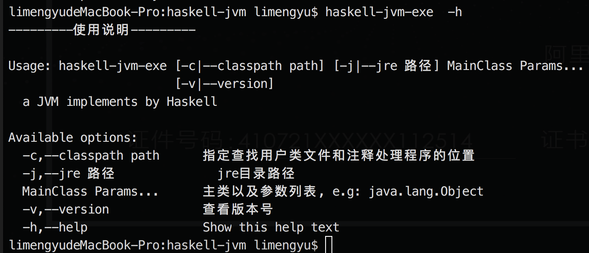
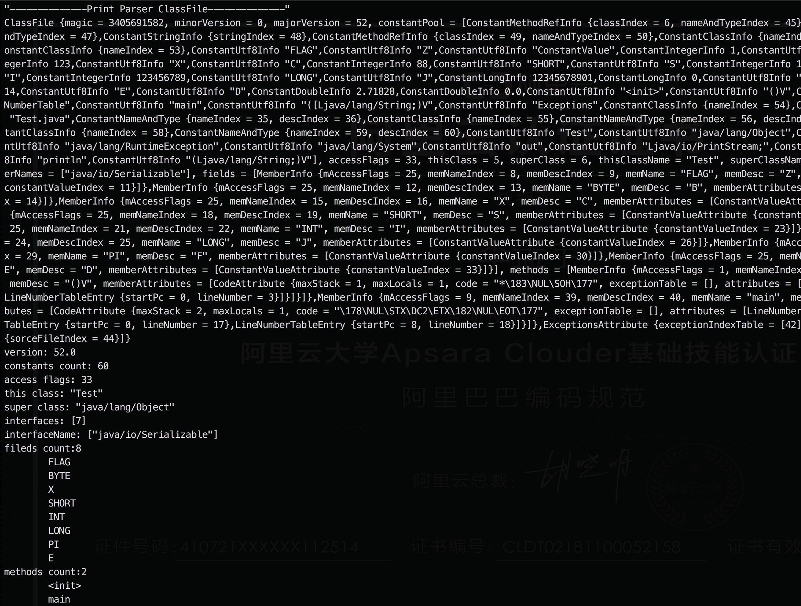
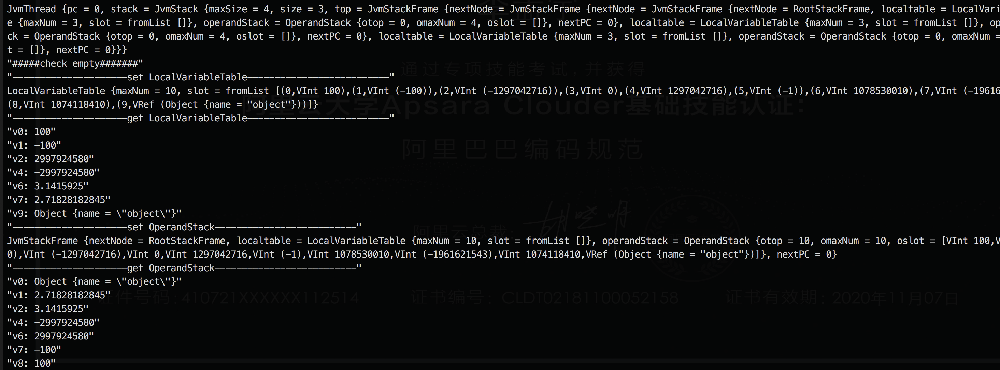
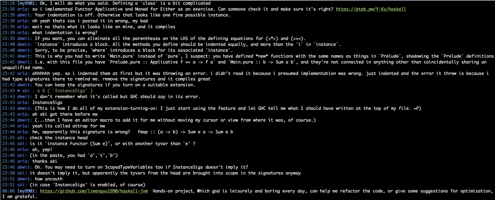
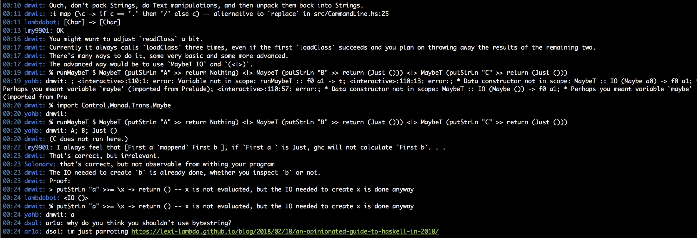
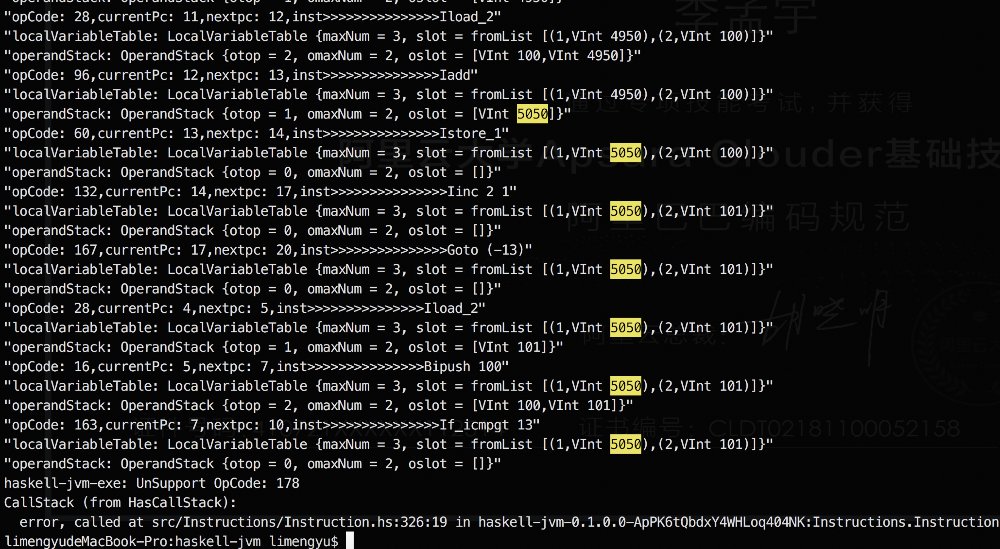

# haskell-jvm

使用Haskell实现的简易JVM,遵循[Java虚拟机规范](https://docs.oracle.com/javase/specs/jvms/se8/html/index.html)，部分代码在[IRC](https://webchat.freenode.net/#haskell-beginners)频道上被大牛review过，后面新增的代码抽时间也会让他们持续review，因此无论是学习FP语言还是深入学习虚拟机都会有所收获。

*命令行解析器:*

*解析class文件:*

*测试局部变量表/操作数栈:*

*测试解释器,计算1+2+...+100:*

## TODO

- [x] 命令行解析 (review)
- [x] class文件解析 (review)
- [x] 运行时数据区
- [x] 指令集
- [x] 解释器
- [] 对象/数组
- [] 引用相关指令集
- [] λ实现
- [] 异常/debug
- [] 增加更多命令行选项

## 资料

[quickcheck](https://begriffs.com/posts/2017-01-14-design-use-quickcheck.html)

[llvm](http://llvm.org/docs/tutorial/)

[llvm-JIT](http://www.stephendiehl.com/llvm/)

[dynamic-compilation](https://www.ibm.com/developerworks/java/library/j-jtp12214/?S_TACT=105AGX52&S_CMP=cn-a-j)

[method-inlining](https://www.javacodegeeks.com/2013/02/how-aggressive-is-method-inlining-in-jvm.html)

[java8lambdas](https://www.beyondjava.net/performance-java-8-lambdas)

[escape-analysis](https://www.cc.gatech.edu/~harrold/6340/cs6340_fall2009/Readings/choi99escape.pdf)

[Java语言规范](https://docs.oracle.com/javase/specs/jls/se8/html/index.html)
